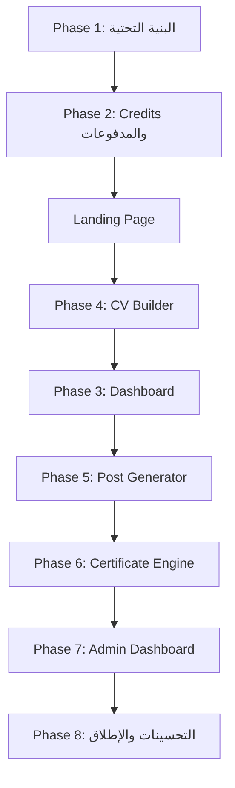
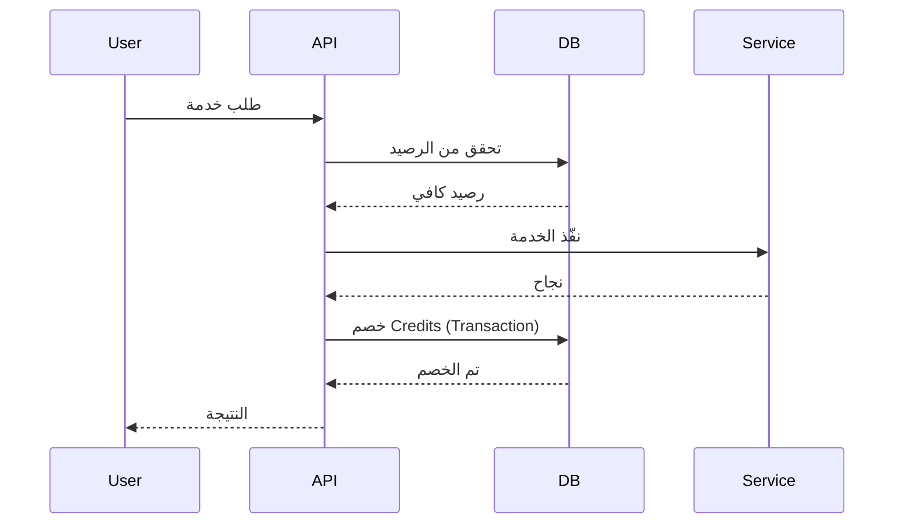
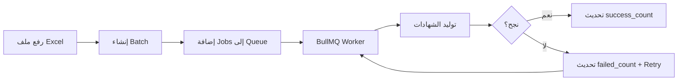

# خطة تنفيذ منصة CvSira v2

## نظرة عامة على المشروع

**CvSira** هي منصة SaaS سعودية توفر 3 منتجات رئيسية:
- 🎯 **CV Builder** - بناء سيرة ذاتية بالذكاء الاصطناعي + PDF
- 📱 **Post Generator** - توليد منشورات سوشيال ميديا بقوالب + AI
- 🏆 **Certificate Engine** - شهادات رقمية + توليد جماعي + QR تحقق

### Stack التقني
- **Frontend:** Next.js 14 (App Router) · TypeScript · Tailwind CSS
- **Backend:** Supabase (Auth + DB + Storage)
- **AI:** OpenRouter API
- **PDF:** Puppeteer API
- **Queue:** BullMQ + Redis
- **Rate Limiting:** Upstash

---

## ترتيب التنفيذ المقترح



---

## المرحلة 1: البنية التحتية والمصادقة 🔴 حرجة

### 1.1 إعداد المشروع
- إنشاء مشروع Next.js 14 مع TypeScript و Tailwind CSS
- تثبيت المكتبات المطلوبة:
  ```bash
  npm install @supabase/supabase-js @supabase/ssr
  npm install nanoid bullmq ioredis
  npm install html-to-image sheetjs
  npm install openai
  npm install @upstash/ratelimit @upstash/redis
  npm install posthog-js
  ```

### 1.2 إعداد Supabase
إنشاء الجداول التالية:
- `usage_credits` - محفظة المستخدم
- `credits_log` - سجل العمليات
- `orders` - الطلبات
- `subscriptions` - الاشتراكات
- `user_roles` - صلاحيات المستخدمين
- `platform_events` - سجل الأحداث
- `feedback` - التقييمات

### 1.3 صفحات المصادقة
- `/login` - صفحة تسجيل الدخول
- `/register` - صفحة التسجيل (مع منح 5 credits)
- `/verify` - صفحة التحقق من البريد

### 1.4 Middleware
- حماية مسارات التطبيق (`/dashboard`, `/cv-builder`, etc.)
- حماية مسارات الأدمن عبر جدول `user_roles`

### 1.5 Feature Flags System
```typescript
export const FEATURES = {
  AI_IMAGE: process.env.ENABLE_AI_IMAGE === 'true',
  BULK_CERTIFICATES: process.env.ENABLE_BULK_CERTIFICATES === 'true',
  JOB_ANALYSIS: process.env.ENABLE_JOB_ANALYSIS === 'true',
  SMART_UPSELL: process.env.ENABLE_SMART_UPSELL === 'true',
}
```

---

## المرحلة 2: نظام Credits والمدفوعات 🔴 حرجة

### 2.1 Credits Engine (مع Reserve-Execute-Commit)


### 2.2 DB Functions
- `deduct_credits_safe` - خصم آمن مع Transaction
- `approve_order_safe` - موافقة آمنة مع Idempotency

### 2.3 Feature Cost Config
```typescript
export const FEATURE_COSTS = {
  cv_generate: 10,
  cv_regenerate_section: 1,
  cv_pdf_download: 5,
  cv_pdf_trial: 1,
  post_draft: 2,
  post_ai_text: 1,
  certificate_single: 15,
  // ...
}
```

### 2.4 Rate Limiting (Upstash)
- CV Generate: 10/ساعة
- CV Download: 5/ساعة
- AI Text: 30/ساعة
- Certificate Generate: 20/ساعة

### 2.5 PayPal Integration
- Idempotency عبر `paypal_capture_id` و `processed` flag
- Webhook Handler للمدفوعات
- Subscription Renewal Handler

### 2.6 Storage Strategy
- رفع PDFs إلى Supabase Storage
- حفظ URLs في قاعدة البيانات
- Buckets: `pdfs`, `certificates`, `post-images`

### 2.7 Event Logger
تسجيل كل الأحداث للتحليلات:
- `user_registered`
- `payment_completed`
- `cv_generated`
- `pdf_downloaded`
- `certificate_issued`
- إلخ...

---

## صفحة الهبوط (Landing Page) 🔴 حرجة

### الأقسام
1. **Hero** - العنوان الرئيسي + CTA
2. **Features Grid** - المميزات الثلاث
3. **How It Works** - كيف تعمل المنصة
4. **Pricing** - الأسعار مع Dynamic Slider
5. **Testimonials** - آراء العملاء
6. **FAQ** - الأسئلة الشائعة
7. **Footer** - تذييل الصفحة

---

## المرحلة 4: CV Builder 🔴 حرجة

### 4.1 CV Schema
```typescript
export type CV = {
  personal: { name: string; title: string; email: string; phone: string; location: string }
  summary: string
  skills: string[]
  experience: { company: string; role: string; start: string; end: string; bullets: string[] }[]
  education: { school: string; degree: string; year: string }[]
}
```

### 4.2 Rendering Engine
- Single Source of Truth: نفس HTML للـ Preview والـ PDF
- Templates: Classic, Modern, Hybrid
- Fonts: Cairo, Tajawal, Inter, Amiri
- RTL Support

### 4.3 APIs
- `POST /api/cv/generate` - توليد CV بالذكاء الاصطناعي (10 credits)
- `POST /api/cv/download` - تحميل PDF (5 credits / 1 trial)
- `POST /api/cv/regenerate-section` - إعادة توليد قسم (1 credit)
- `POST /api/cv/analyze` - تحليل الوظيفة

### 4.4 UI Layout
```
┌──────────────────────┬─────────────────────────────┐
│ Controls (35%)       │ Live Preview (65%)           │
│                      │                              │
│ [Template]           │  ┌───────────────────────┐   │
│  classic             │  │  iframe srcDoc={html}  │   │
│  modern              │  │  A4 — 210mm × 297mm    │   │
│  hybrid              │  └───────────────────────┘   │
│                      │                              │
│ [Font] [Color]       │  📊 Job Match: 78%            │
│                      │  ✅ Strong: JavaScript, React │
│ [Job Description]    │  ❌ Missing: Docker, GraphQL  │
│ [Generate ✨ -10cr]  │                              │
│                      │                              │
│ [Download PDF]       │                              │
│  Cost: 5 cr          │                              │
│  Trial: 1 cr 🎁      │                              │
└──────────────────────┴─────────────────────────────┘
```

---

## المرحلة 3: لوحة تحكم المستخدم 🟡 عالية

### 3.1 Dashboard Structure
```
┌─────────────────────────────────────────────────────┐
│  مرحبًا، [اسم المستخدم] 👋                           │
│  [320 Credits ≈ 21 شهادة · 10 سيرة] · [Starter]    │
│  🎁 تحميل مجاني متاح (Trial)                        │
├─────────────────────────────────────────────────────┤
│  [Usage: 1,200] [Orders: 8] [Pending: 1]            │
├─────────────────────────────────────────────────────┤
│  ⚡ إجراءات سريعة                                    │
│  [CV Builder] [Post Generator] [شهادة] [شراء]       │
├─────────────────────────────────────────────────────┤
│  ⚠️  رصيدك منخفض — [اشحن الآن]                      │
│  ⏳  طلب دفع قيد المراجعة                            │
│  🔥  لم تجرب CV Builder بعد — [جرّبه الآن]          │
├─────────────────────────────────────────────────────┤
│  📦 طلباتي (Credits | Amount | Status | Date)       │
├─────────────────────────────────────────────────────┤
│  📊 استخدامي (CV: 50 | Posts: 30 | Certs: 100)     │
├─────────────────────────────────────────────────────┤
│  💬 تقييمك يهمنا ⭐ ⭐ ⭐ ⭐ ⭐                        │
└─────────────────────────────────────────────────────┘
```

### 3.2 Smart Upsell Engine
```typescript
export function getUpsellSuggestion(
  usage: { cv: number; post: number; cert: number },
  plan: string,
  balance: number
): UpsellSuggestion | null
```

---

## المرحلة 5: Post Generator 🟡 عالية

### 5.1 Templates System
- قوالب جاهزة للمناسبات المختلفة
- تخصيص الألوان والخطوط

### 5.2 APIs
- `POST /api/post/ai-text` - توليد نص بالذكاء الاصطناعي (1 credit)
- `POST /api/post/ai-image` - توليد صورة (Feature Flag) (1-2 credits)

### 5.3 Soft Fail UX
عند فشل الذكاء الاصطناعي، عرض template افتراضي بدلاً من إيقاف المستخدم

---

## المرحلة 6: Certificate Engine 🟡 عالية

### 6.1 Database
- `certificates` - الشهادات
- `certificate_templates` - قوالب الشهادات
- `certificate_batches` - عمليات التوليد الجماعي

### 6.2 Bulk Generation Flow


### 6.3 Retry Strategy
```typescript
{
  attempts: 3,
  backoff: {
    type: 'exponential',
    delay: 2000  // 2s → 4s → 8s
  }
}
```

### 6.4 QR Verification
- كود تحقق فريد لكل شهادة
- صفحة عامة للتحقق: `/verify/[code]`

---

## المرحلة 7: لوحة تحكم الأدمن 🟢 متوسطة

### 7.1 Admin Features
- إدارة الطلبات (موافقة/رفض)
- إدارة المستخدمين وتغيير الصلاحيات
- Analytics من `platform_events`
- مراقبة النظام

### 7.2 APIs
- `POST /api/admin/orders/approve` - موافقة على طلب
- `POST /api/admin/users/role` - تغيير صلاحية مستخدم
- `GET /api/admin/analytics` - بيانات التحليلات

---

## المرحلة 8: التحسينات والإطلاق 🟢 متوسطة

### 8.1 Unified Error Handling
```typescript
export const ERRORS = {
  INSUFFICIENT_CREDITS: { code: 'INSUFFICIENT_CREDITS', status: 402 },
  RATE_LIMIT_EXCEEDED: { code: 'RATE_LIMIT_EXCEEDED', status: 429 },
  PDF_FAILED: { code: 'PDF_FAILED', status: 503 },
  INVALID_AI_RESPONSE: { code: 'INVALID_AI_RESPONSE', status: 500 },
  FEATURE_DISABLED: { code: 'FEATURE_DISABLED', status: 503 },
  UNAUTHORIZED: { code: 'UNAUTHORIZED', status: 401 },
}
```

### 8.2 Performance
- Debouncing للـ CV Preview
- Memoization للمكونات الثقيلة

### 8.3 Anti-Abuse
- 3 طبقات حماية: Frontend + API + DB Transaction
- Email Verification قبل Credits
- Trial Abuse Prevention

### 8.4 Launch Checklist
- [ ] Email Verification مفعّل
- [ ] `deduct_credits_safe` مختبرة
- [ ] `approve_order_safe` Idempotency مختبرة
- [ ] PayPal Webhook يعمل
- [ ] Puppeteer API يعمل
- [ ] Redis/BullMQ جاهز
- [ ] Supabase Storage Buckets مُنشأة
- [ ] Rate Limiting مفعّل
- [ ] Admin Role مُعيَّن
- [ ] الخطوط مُضمَّنة في HTML
- [ ] HTTPS + Domain مُعدّ

---

## المبادئ الهندسية الحرجة

| المبدأ | التطبيق |
|--------|---------|
| Single Source of Truth | نفس HTML = Preview + PDF |
| Credits via Orders Layer | لا دفع مباشر للـ Wallet |
| Reserve → Execute → Commit | لا خسارة credits عند فشل الخدمة |
| Idempotency | لا credits مضاعفة من Webhooks |
| DB Transaction | لا Race Conditions |
| Event Logging | كل حدث مسجّل للـ Analytics |

---

## نموذج الإيرادات

```
Free Trial  → 5 credits عند التسجيل (trial_pdf_used = false)
Starter     → 49 SAR/شهر → 100 credits
Pro         → 129 SAR/شهر → 350 credits + مزايا
Credits Pack → حزم متعددة (10 SAR → 2450 SAR)
```

---

## تكاليف الميزات

| الميزة | التكلفة |
|--------|---------|
| CV Generate | 10 credits |
| CV PDF Download | 5 credits (1 trial) |
| Post Draft | 2 credits |
| Post AI Text | 1 credit |
| Certificate Single | 15 credits |
| Certificate Bulk (11-50) | 12 credits/شهادة |
| Certificate Bulk (51+) | 8 credits/شهادة |

---

*تم إنشاء هذه الخطة بناءً على ملف CvSira_Project_Plan_v2.md*
